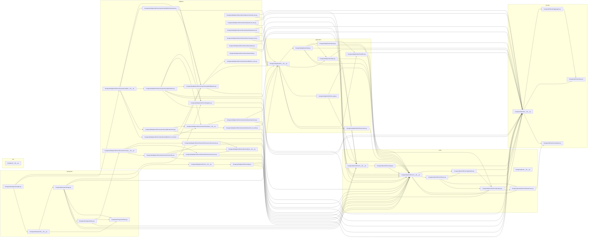

```mermaid
flowchart LR
  subgraph entrypoints
    src_hexagonal_entrypoints___init___py["hexagonal/entrypoints/__init__.py"]
    src_hexagonal_entrypoints_app_py["hexagonal/entrypoints/app.py"]
    src_hexagonal_entrypoints_base_py["hexagonal/entrypoints/base.py"]
    src_hexagonal_entrypoints_bus_py["hexagonal/entrypoints/bus.py"]
    src_hexagonal_entrypoints_sqlite_py["hexagonal/entrypoints/sqlite.py"]
  end
  subgraph adapters
    src_hexagonal_adapters_drivens_buses_base___init___py["hexagonal/adapters/drivens/buses/base/__init__.py"]
    src_hexagonal_adapters_drivens_buses_base_command_bus_py["hexagonal/adapters/drivens/buses/base/command_bus.py"]
    src_hexagonal_adapters_drivens_buses_base_event_bus_py["hexagonal/adapters/drivens/buses/base/event_bus.py"]
    src_hexagonal_adapters_drivens_buses_base_infrastructure_py["hexagonal/adapters/drivens/buses/base/infrastructure.py"]
    src_hexagonal_adapters_drivens_buses_base_message_bus_py["hexagonal/adapters/drivens/buses/base/message_bus.py"]
    src_hexagonal_adapters_drivens_buses_base_query_py["hexagonal/adapters/drivens/buses/base/query.py"]
    src_hexagonal_adapters_drivens_buses_base_utils_py["hexagonal/adapters/drivens/buses/base/utils.py"]
    src_hexagonal_adapters_drivens_buses_inmemory___init___py["hexagonal/adapters/drivens/buses/inmemory/__init__.py"]
    src_hexagonal_adapters_drivens_buses_inmemory_command_bus_py["hexagonal/adapters/drivens/buses/inmemory/command_bus.py"]
    src_hexagonal_adapters_drivens_buses_inmemory_event_bus_py["hexagonal/adapters/drivens/buses/inmemory/event_bus.py"]
    src_hexagonal_adapters_drivens_buses_inmemory_infra_py["hexagonal/adapters/drivens/buses/inmemory/infra.py"]
    src_hexagonal_adapters_drivens_mappers_py["hexagonal/adapters/drivens/mappers.py"]
    src_hexagonal_adapters_drivens_repository_base___init___py["hexagonal/adapters/drivens/repository/base/__init__.py"]
    src_hexagonal_adapters_drivens_repository_base_repository_py["hexagonal/adapters/drivens/repository/base/repository.py"]
    src_hexagonal_adapters_drivens_repository_base_unit_of_work_py["hexagonal/adapters/drivens/repository/base/unit_of_work.py"]
    src_hexagonal_adapters_drivens_repository_sqlite___init___py["hexagonal/adapters/drivens/repository/sqlite/__init__.py"]
    src_hexagonal_adapters_drivens_repository_sqlite_datastore_py["hexagonal/adapters/drivens/repository/sqlite/datastore.py"]
    src_hexagonal_adapters_drivens_repository_sqlite_env_vars_py["hexagonal/adapters/drivens/repository/sqlite/env_vars.py"]
    src_hexagonal_adapters_drivens_repository_sqlite_infrastructure_py["hexagonal/adapters/drivens/repository/sqlite/infrastructure.py"]
    src_hexagonal_adapters_drivens_repository_sqlite_outbox_py["hexagonal/adapters/drivens/repository/sqlite/outbox.py"]
    src_hexagonal_adapters_drivens_repository_sqlite_repository_py["hexagonal/adapters/drivens/repository/sqlite/repository.py"]
    src_hexagonal_adapters_drivens_repository_sqlite_unit_of_work_py["hexagonal/adapters/drivens/repository/sqlite/unit_of_work.py"]
    src_hexagonal_adapters_drivers___init___py["hexagonal/adapters/drivers/__init__.py"]
    src_hexagonal_adapters_drivers_app_py["hexagonal/adapters/drivers/app.py"]
  end
  subgraph application
    src_hexagonal_application___init___py["hexagonal/application/__init__.py"]
    src_hexagonal_application_api_py["hexagonal/application/api.py"]
    src_hexagonal_application_app_py["hexagonal/application/app.py"]
    src_hexagonal_application_bus_app_py["hexagonal/application/bus_app.py"]
    src_hexagonal_application_handlers_py["hexagonal/application/handlers.py"]
    src_hexagonal_application_infrastructure_py["hexagonal/application/infrastructure.py"]
    src_hexagonal_application_query_py["hexagonal/application/query.py"]
  end
  subgraph domain
    src_hexagonal_domain___init___py["hexagonal/domain/__init__.py"]
    src_hexagonal_domain_aggregate_py["hexagonal/domain/aggregate.py"]
    src_hexagonal_domain_base_py["hexagonal/domain/base.py"]
    src_hexagonal_domain_exceptions_py["hexagonal/domain/exceptions.py"]
  end
  subgraph ports
    src_hexagonal_ports___init___py["hexagonal/ports/__init__.py"]
    src_hexagonal_ports_drivens___init___py["hexagonal/ports/drivens/__init__.py"]
    src_hexagonal_ports_drivens_application_py["hexagonal/ports/drivens/application.py"]
    src_hexagonal_ports_drivens_buses_py["hexagonal/ports/drivens/buses.py"]
    src_hexagonal_ports_drivens_infrastructure_py["hexagonal/ports/drivens/infrastructure.py"]
    src_hexagonal_ports_drivens_repository_py["hexagonal/ports/drivens/repository.py"]
    src_hexagonal_ports_drivers___init___py["hexagonal/ports/drivers/__init__.py"]
    src_hexagonal_ports_drivers_app_py["hexagonal/ports/drivers/app.py"]
  end
  subgraph root
    src_hexagonal___init___py["hexagonal/__init__.py"]
  end
  src_hexagonal_adapters_drivens_buses_base_command_bus_py --> src_hexagonal_domain___init___py
  src_hexagonal_adapters_drivens_buses_base_command_bus_py --> src_hexagonal_ports_drivens___init___py
  src_hexagonal_adapters_drivens_buses_base_event_bus_py --> src_hexagonal_domain___init___py
  src_hexagonal_adapters_drivens_buses_base_event_bus_py --> src_hexagonal_ports_drivens___init___py
  src_hexagonal_adapters_drivens_buses_base_infrastructure_py --> src_hexagonal_application___init___py
  src_hexagonal_adapters_drivens_buses_base_infrastructure_py --> src_hexagonal_ports_drivens___init___py
  src_hexagonal_adapters_drivens_buses_base_message_bus_py --> src_hexagonal_application___init___py
  src_hexagonal_adapters_drivens_buses_base_message_bus_py --> src_hexagonal_domain___init___py
  src_hexagonal_adapters_drivens_buses_base_message_bus_py --> src_hexagonal_ports_drivens___init___py
  src_hexagonal_adapters_drivens_buses_base_query_py --> src_hexagonal_application___init___py
  src_hexagonal_adapters_drivens_buses_base_query_py --> src_hexagonal_domain___init___py
  src_hexagonal_adapters_drivens_buses_base_query_py --> src_hexagonal_ports_drivens___init___py
  src_hexagonal_adapters_drivens_buses_inmemory___init___py --> src_hexagonal_adapters_drivens_buses_inmemory_command_bus_py
  src_hexagonal_adapters_drivens_buses_inmemory___init___py --> src_hexagonal_adapters_drivens_buses_inmemory_event_bus_py
  src_hexagonal_adapters_drivens_buses_inmemory___init___py --> src_hexagonal_adapters_drivens_buses_inmemory_infra_py
  src_hexagonal_adapters_drivens_buses_inmemory_command_bus_py --> src_hexagonal_adapters_drivens_buses_base___init___py
  src_hexagonal_adapters_drivens_buses_inmemory_command_bus_py --> src_hexagonal_domain___init___py
  src_hexagonal_adapters_drivens_buses_inmemory_command_bus_py --> src_hexagonal_ports_drivens___init___py
  src_hexagonal_adapters_drivens_buses_inmemory_event_bus_py --> src_hexagonal_adapters_drivens_buses_base___init___py
  src_hexagonal_adapters_drivens_buses_inmemory_event_bus_py --> src_hexagonal_domain___init___py
  src_hexagonal_adapters_drivens_buses_inmemory_event_bus_py --> src_hexagonal_ports_drivens___init___py
  src_hexagonal_adapters_drivens_buses_inmemory_infra_py --> src_hexagonal_adapters_drivens_buses_base___init___py
  src_hexagonal_adapters_drivens_buses_inmemory_infra_py --> src_hexagonal_adapters_drivens_buses_inmemory_command_bus_py
  src_hexagonal_adapters_drivens_buses_inmemory_infra_py --> src_hexagonal_adapters_drivens_buses_inmemory_event_bus_py
  src_hexagonal_adapters_drivens_buses_inmemory_infra_py --> src_hexagonal_ports_drivens___init___py
  src_hexagonal_adapters_drivens_mappers_py --> src_hexagonal_domain___init___py
  src_hexagonal_adapters_drivens_repository_base___init___py --> src_hexagonal_adapters_drivens_repository_base_repository_py
  src_hexagonal_adapters_drivens_repository_base___init___py --> src_hexagonal_adapters_drivens_repository_base_unit_of_work_py
  src_hexagonal_adapters_drivens_repository_base_repository_py --> src_hexagonal_application___init___py
  src_hexagonal_adapters_drivens_repository_base_repository_py --> src_hexagonal_domain___init___py
  src_hexagonal_adapters_drivens_repository_base_repository_py --> src_hexagonal_ports_drivens___init___py
  src_hexagonal_adapters_drivens_repository_base_unit_of_work_py --> src_hexagonal_application___init___py
  src_hexagonal_adapters_drivens_repository_base_unit_of_work_py --> src_hexagonal_ports_drivens___init___py
  src_hexagonal_adapters_drivens_repository_sqlite___init___py --> src_hexagonal_adapters_drivens_repository_sqlite_datastore_py
  src_hexagonal_adapters_drivens_repository_sqlite___init___py --> src_hexagonal_adapters_drivens_repository_sqlite_infrastructure_py
  src_hexagonal_adapters_drivens_repository_sqlite___init___py --> src_hexagonal_adapters_drivens_repository_sqlite_outbox_py
  src_hexagonal_adapters_drivens_repository_sqlite___init___py --> src_hexagonal_adapters_drivens_repository_sqlite_repository_py
  src_hexagonal_adapters_drivens_repository_sqlite___init___py --> src_hexagonal_adapters_drivens_repository_sqlite_unit_of_work_py
  src_hexagonal_adapters_drivens_repository_sqlite_datastore_py --> src_hexagonal_adapters_drivens_repository_sqlite_env_vars_py
  src_hexagonal_adapters_drivens_repository_sqlite_datastore_py --> src_hexagonal_application___init___py
  src_hexagonal_adapters_drivens_repository_sqlite_datastore_py --> src_hexagonal_ports_drivens___init___py
  src_hexagonal_adapters_drivens_repository_sqlite_infrastructure_py --> src_hexagonal_adapters_drivens_mappers_py
  src_hexagonal_adapters_drivens_repository_sqlite_infrastructure_py --> src_hexagonal_adapters_drivens_repository_sqlite_datastore_py
  src_hexagonal_adapters_drivens_repository_sqlite_infrastructure_py --> src_hexagonal_application___init___py
  src_hexagonal_adapters_drivens_repository_sqlite_outbox_py --> src_hexagonal_adapters_drivens_mappers_py
  src_hexagonal_adapters_drivens_repository_sqlite_outbox_py --> src_hexagonal_adapters_drivens_repository_base___init___py
  src_hexagonal_adapters_drivens_repository_sqlite_outbox_py --> src_hexagonal_adapters_drivens_repository_sqlite_datastore_py
  src_hexagonal_adapters_drivens_repository_sqlite_outbox_py --> src_hexagonal_application___init___py
  src_hexagonal_adapters_drivens_repository_sqlite_outbox_py --> src_hexagonal_domain___init___py
  src_hexagonal_adapters_drivens_repository_sqlite_outbox_py --> src_hexagonal_ports_drivens___init___py
  src_hexagonal_adapters_drivens_repository_sqlite_repository_py --> src_hexagonal_adapters_drivens_repository_base___init___py
  src_hexagonal_adapters_drivens_repository_sqlite_repository_py --> src_hexagonal_adapters_drivens_repository_sqlite_datastore_py
  src_hexagonal_adapters_drivens_repository_sqlite_repository_py --> src_hexagonal_domain___init___py
  src_hexagonal_adapters_drivens_repository_sqlite_unit_of_work_py --> src_hexagonal_adapters_drivens_repository_base___init___py
  src_hexagonal_adapters_drivens_repository_sqlite_unit_of_work_py --> src_hexagonal_adapters_drivens_repository_sqlite_datastore_py
  src_hexagonal_adapters_drivens_repository_sqlite_unit_of_work_py --> src_hexagonal_ports_drivens_repository_py
  src_hexagonal_adapters_drivers___init___py --> src_hexagonal_adapters_drivers_app_py
  src_hexagonal_adapters_drivers_app_py --> src_hexagonal_domain___init___py
  src_hexagonal_adapters_drivers_app_py --> src_hexagonal_ports_drivens___init___py
  src_hexagonal_adapters_drivers_app_py --> src_hexagonal_ports_drivers___init___py
  src_hexagonal_application___init___py --> src_hexagonal_application_api_py
  src_hexagonal_application___init___py --> src_hexagonal_application_app_py
  src_hexagonal_application___init___py --> src_hexagonal_application_bus_app_py
  src_hexagonal_application___init___py --> src_hexagonal_application_handlers_py
  src_hexagonal_application___init___py --> src_hexagonal_application_infrastructure_py
  src_hexagonal_application_api_py --> src_hexagonal_application_app_py
  src_hexagonal_application_api_py --> src_hexagonal_application_query_py
  src_hexagonal_application_api_py --> src_hexagonal_domain___init___py
  src_hexagonal_application_api_py --> src_hexagonal_ports_drivens___init___py
  src_hexagonal_application_api_py --> src_hexagonal_ports_drivers___init___py
  src_hexagonal_application_app_py --> src_hexagonal_domain___init___py
  src_hexagonal_application_app_py --> src_hexagonal_ports_drivens___init___py
  src_hexagonal_application_app_py --> src_hexagonal_ports_drivers___init___py
  src_hexagonal_application_bus_app_py --> src_hexagonal_ports_drivens___init___py
  src_hexagonal_application_bus_app_py --> src_hexagonal_ports_drivers___init___py
  src_hexagonal_application_handlers_py --> src_hexagonal_domain___init___py
  src_hexagonal_application_handlers_py --> src_hexagonal_ports_drivens___init___py
  src_hexagonal_application_infrastructure_py --> src_hexagonal_ports_drivens___init___py
  src_hexagonal_application_query_py --> src_hexagonal_application_handlers_py
  src_hexagonal_application_query_py --> src_hexagonal_domain___init___py
  src_hexagonal_application_query_py --> src_hexagonal_ports_drivens___init___py
  src_hexagonal_application_query_py --> src_hexagonal_ports_drivens_repository_py
  src_hexagonal_domain___init___py --> src_hexagonal_domain_aggregate_py
  src_hexagonal_domain___init___py --> src_hexagonal_domain_base_py
  src_hexagonal_domain___init___py --> src_hexagonal_domain_exceptions_py
  src_hexagonal_domain_aggregate_py --> src_hexagonal_domain_base_py
  src_hexagonal_entrypoints___init___py --> src_hexagonal_entrypoints_app_py
  src_hexagonal_entrypoints___init___py --> src_hexagonal_entrypoints_base_py
  src_hexagonal_entrypoints_app_py --> src_hexagonal_adapters_drivers___init___py
  src_hexagonal_entrypoints_app_py --> src_hexagonal_application___init___py
  src_hexagonal_entrypoints_app_py --> src_hexagonal_entrypoints_base_py
  src_hexagonal_entrypoints_app_py --> src_hexagonal_entrypoints_bus_py
  src_hexagonal_entrypoints_app_py --> src_hexagonal_ports_drivens___init___py
  src_hexagonal_entrypoints_app_py --> src_hexagonal_ports_drivers___init___py
  src_hexagonal_entrypoints_bus_py --> src_hexagonal_adapters_drivens_buses_inmemory___init___py
  src_hexagonal_entrypoints_bus_py --> src_hexagonal_entrypoints_base_py
  src_hexagonal_entrypoints_bus_py --> src_hexagonal_ports_drivens___init___py
  src_hexagonal_entrypoints_sqlite_py --> src_hexagonal_adapters_drivens_mappers_py
  src_hexagonal_entrypoints_sqlite_py --> src_hexagonal_adapters_drivens_repository_sqlite___init___py
  src_hexagonal_entrypoints_sqlite_py --> src_hexagonal_entrypoints___init___py
  src_hexagonal_ports_drivens___init___py --> src_hexagonal_ports_drivens_application_py
  src_hexagonal_ports_drivens___init___py --> src_hexagonal_ports_drivens_buses_py
  src_hexagonal_ports_drivens___init___py --> src_hexagonal_ports_drivens_infrastructure_py
  src_hexagonal_ports_drivens___init___py --> src_hexagonal_ports_drivens_repository_py
  src_hexagonal_ports_drivens_application_py --> src_hexagonal_domain___init___py
  src_hexagonal_ports_drivens_application_py --> src_hexagonal_ports_drivens_repository_py
  src_hexagonal_ports_drivens_buses_py --> src_hexagonal_domain___init___py
  src_hexagonal_ports_drivens_buses_py --> src_hexagonal_ports_drivens_application_py
  src_hexagonal_ports_drivens_buses_py --> src_hexagonal_ports_drivens_infrastructure_py
  src_hexagonal_ports_drivens_buses_py --> src_hexagonal_ports_drivens_repository_py
  src_hexagonal_ports_drivens_infrastructure_py --> src_hexagonal_domain_exceptions_py
  src_hexagonal_ports_drivens_repository_py --> src_hexagonal_domain___init___py
  src_hexagonal_ports_drivens_repository_py --> src_hexagonal_ports_drivens_infrastructure_py
  src_hexagonal_ports_drivers___init___py --> src_hexagonal_ports_drivers_app_py
  src_hexagonal_ports_drivers_app_py --> src_hexagonal_domain___init___py
  src_hexagonal_ports_drivers_app_py --> src_hexagonal_ports_drivens___init___py
```